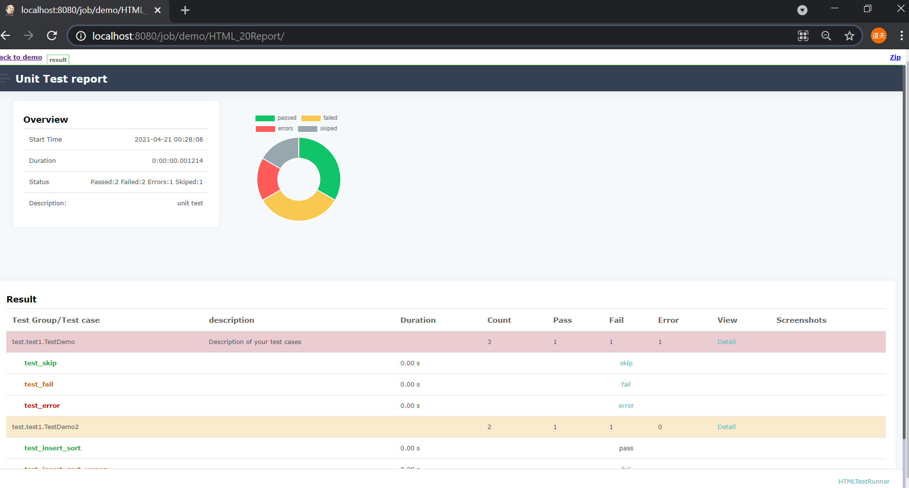
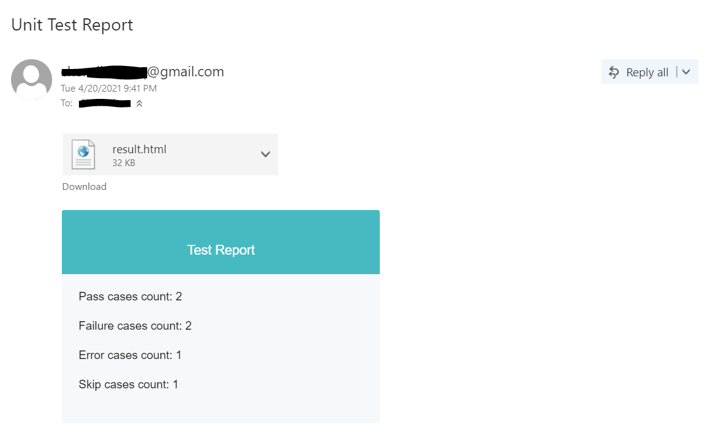

# python-unittest-htmlTestRunner-jenkins-demo

This demo will show how to intergrate python unittest with Jenkins and generate elegant HTML reports on Jenkins.

You can view the video explaination here [https://www.youtube.com/watch?v=VDmBfglO6YQ](https://www.youtube.com/watch?v=VDmBfglO6YQ).

If you do not have experience of Jenkins, you can also view the demo with GitHub Action with this link :smirk: [https://github.com/Spycsh/python-unittest-htmlTestRunner-GitHub-Action-demo](https://github.com/Spycsh/python-unittest-htmlTestRunner-GitHub-Action-demo).

## Download this demo
```
git clone https://github.com/Spycsh/python-unittest-htmlTestRunner-jenkins-demo.git
```

`/src` is the folder where you lay your implementation code.
`/test` is the folder where you write your tests.
`/TestRunner` is a utility folder you can import to generate elegant HTML reports.
`main.py` is the script you write to invoke the process of unit testing, generate HTML reports and send emails.

## Write your own implementation in `/src` and your test in `/test` and `main.py`

In `main.py`, you can use TestRunner to generate the HTML report in the assigned location and if you use email functions, you can specify the sender and receiver of the HTML report in the code.

## Integrate with Jenkins

1. Open your Jenkins (click localhost:8080 in your browser)

2. Create a new item -> Freestyle project

3. In **Source Code Management**, select git (if there is no git, please download [link](https://plugins.jenkins.io/git/) ) , and then enter your github or gitlab repository address. For example: (https://github.com/Spycsh/python-unittest-htmlTestRunner-jenkins-demo.git)

4. In **Branch Specifier (blank for 'any')**
write `*/main` if you only want Jenkins to poll changes on main branch. (`*master` in a deprecated way)

5. In **Build Triggers**
select `Poll SCM` and edit **Scedule** with `H/4 * * * *`, which means that Jenkins will poll the changes on the main branch of your project repository with every 4 minutes.

6. In **Build**
select `execute Windows batch command`, write your command to execute the scripts.
For example: 
```
pip install --user -r requirements.txt
python main.py
```
So it means as demonstrated in Step 5, if there are some changes on the github, then it will execute the `main.py`.

7. In **Post-build Actions**
If you do not find any post-build action, please download [link](https://plugins.jenkins.io/htmlpublisher/).
Then you should fill in the report address in **Index page[s]**, namely `result.html` in this project.
And then you can assign the report title.

8. Click "Apply" -> "Save"


## Results





## Potential Problem and Solution
* If you find no CSS found in html report

It's partly because some in-line CSS is forbidden in Jenkins.  

Solution:
```
http://localhost:8080/script
```
In the text editor, add
```
System.setProperty("hudson.model.DirectoryBrowserSupport.CSP", "")
```
build again, report is integrated with CSS and elegantly shown.
